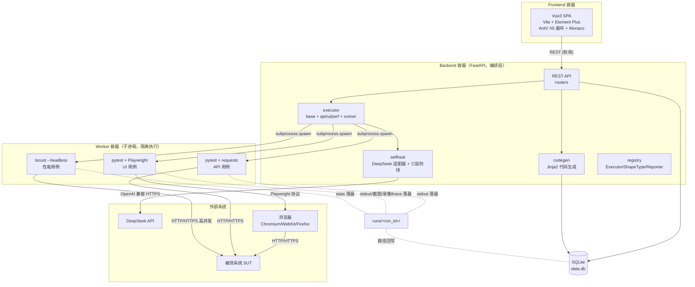

# 容器视图（C4 Level 2）

> C4 模型第 2 层：系统内部的主要部署单元（容器）及其交互
> 配套：system-context.md（L1）/ sequence-diagrams.md / architecture-review.md

## 图

## 容器职责

| 容器 | 技术 | 职责 | 关键约束 |
|------|------|------|---------|
| **Frontend** | Vue3 + Vite + X6 + Monaco | 画布编辑、流转图、用例/需求管理、执行查看、AI 设置 | 只通过 REST 与后端交互，不直连 DB |
| **Backend (FastAPI)** | FastAPI + SQLAlchemy | 编排：CRUD、代码生成调度、执行 spawn、自愈触发 | **不跑测试**，一律 spawn 子进程（ADR-0001） |
| **Worker** | pytest/Playwright/Locust | 隔离执行测试代码 | 子进程，stdout 落盘 runs/&lt;run_id&gt;/，超时可 kill |
| **DB** | SQLite（预留 MySQL） | 全部业务数据 + 自愈审计 + TestRun | 单文件，ORM 隔离便于切换 |

## 主要数据流

1. **执行流**：SPA → API → EXEC → spawn Worker → 历程，stdout/report 落 runs/，路径回写 DB
2. **自愈流**：Worker 内定位失败 → 通过 Backend selfheal 调 DeepSeek → 返回候选 → 三层验证 → 写 locator_history → 回 DB
3. **录制流**（阶段 5）：SPA 触发 → Backend spawn Playwright codegen → 收集操作/定位器/坐标 → 建 Shape + Step → 回 DB

## 端口/位置（MVP 单机）

| 项 | 默认 |
|----|------|
| Frontend dev | `http://localhost:5173`（Vite）|
| Backend API | `http://localhost:8000`（FastAPI）|
| SQLite | `./data.db` |
| 产物 | `./runs/<run_id>/` |
| DeepSeek | `https://api.deepseek.com`（env 配 key）|