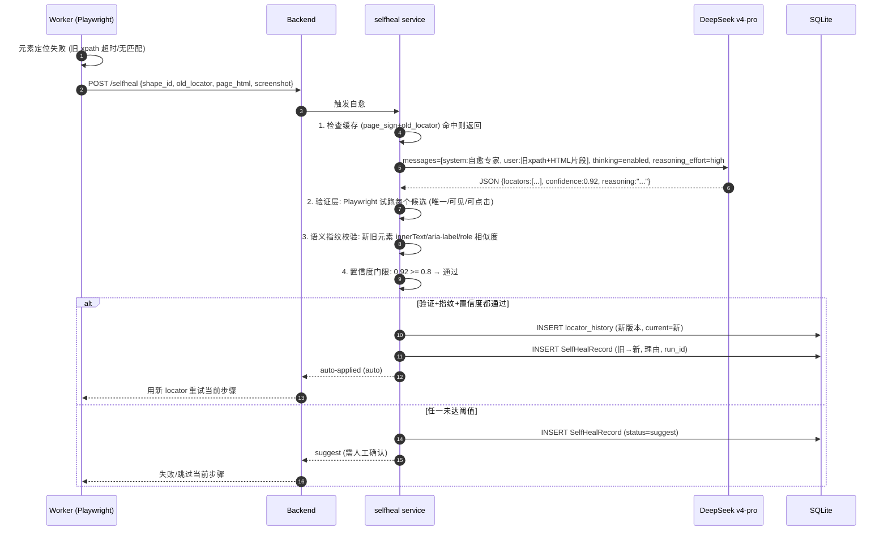
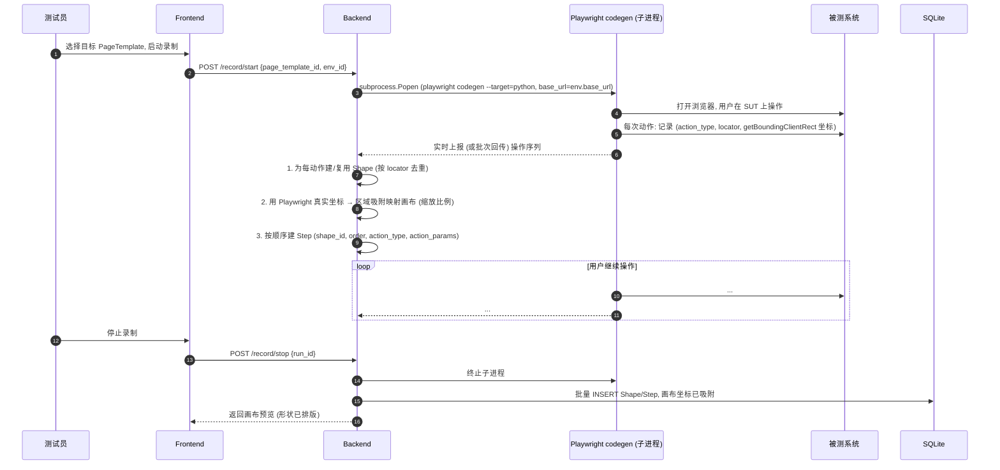

# 关键时序图（Mermaid）

> 3 个最关键运行时场景的时序视图
> 配套：container-view.md / architecture-review.md / ADR-0001/0005/0006

## 1. 执行流转时序

```mermaid
sequenceDiagram
    autonumber
    participant U as 测试员
    participant SPA as Frontend (Vue3)
    participant API as Backend (FastAPI)
    participant EX as Executor
    participant WK as Worker (子进程)
    participant DB as SQLite
    participant FS as runs/&lt;run_id&gt;/

    U->>SPA: 点击"执行" (选 TestCase + Environment)
    SPA->>API: POST /runs {testcase_id, env_id}
    API->>DB: INSERT TestRun (status=running)
    API->>EX: Executor.generate_code(testcase, env)
    EX->>FS: 写 generated/*.py + conftest.py
    EX->>FS: 写 locustfile.py (若 perf) / POM 文件 (若 UI)
    EX->>WK: subprocess.Popen (uv run pytest ..., cwd=runs/&lt;run_id&gt;/)
    WK-->>FS: stdout 流式写 log.txt
    WK-->>FS: 失败截图/录像/trace 落盘
    loop 轮询 (每 1-2s)
        SPA->>API: GET /runs/{id}
        API->>DB: SELECT status
        API-->>SPA: {status, progress}
    end
    WK-->>EX: 退出码 0/1/超时
    EX->>DB: UPDATE TestRun (status, exit_code,finished_at, paths)
    EX->>FS: 报告落盘 report.html
```

**关键约束**：FastAPI 进程自始至终不跑测试，只 spawn 与轮询；Worker 隔离崩溃不影响编排层。

## 2. 自愈流程时序



**关键约束**：三层防线（验证/指纹/置信度）是核心投入点；只有三层全过才自动改，否则降级为建议（ADR-0005）。回滚 = 切回 locator_history 旧版本 current。

## 3. 录制导入时序（阶段 5）



**关键约束**：录制在子进程跑（ADR-0001）；区域吸附用 Playwright 真实坐标缩放上画布，不调用 AI（避免布局不稳定、过度工程）；坐标取不到（iframe 内）降级为时间序排列。