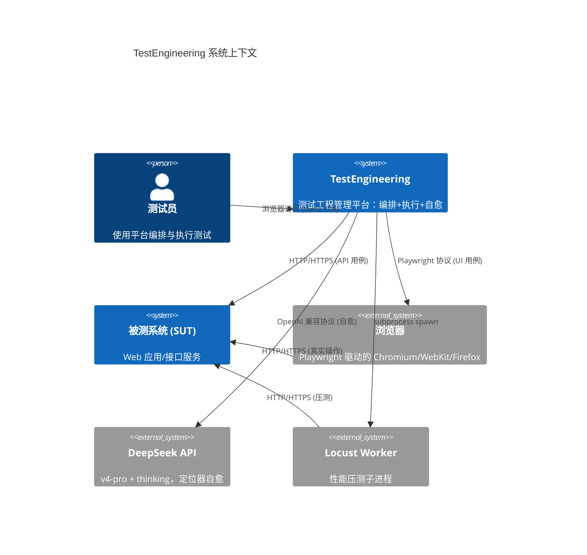

# 系统上下文（C4 Level 1）

> C4 模型第 1 层：本系统与外部系统/人员的边界关系
> 配套：container-view.md（L2）/ sequence-diagrams.md / architecture-review.md

## 图

## 边界说明

| 边界 | 协议/方式 | 说明 |
|------|---------|------|
| 测试员 ↔ TestEngineering | HTTP（浏览器） | Vue3 SPA，FastAPI 提供 REST |
| TestEngineering ↔ SUT | HTTP/HTTPS | API 用例直接发请求；UI 用例经浏览器 |
| TestEngineering ↔ 浏览器 | Playwright 协议 | 子进程内驱动浏览器，浏览器再访问 SUT |
| TestEngineering ↔ DeepSeek | HTTPS（OpenAI 兼容）| 仅定位失败时调用，触发率 < 10% |
| TestEngineering ↔ Locust | subprocess | Locust 在 worker 子进程跑（`locust --headless`），Stats API 抓指标 |

## 关键约束（来自 ADR）

- TestEngineering 内部分两层：FastAPI 编排 + Worker 子进程执行（ADR-0001）
- 浏览器、Locust 都不与 SUT 直接经 TestEngineering 转发，由 worker 子进程驱动
- DeepSeek 仅自愈调用，不在执行主路径